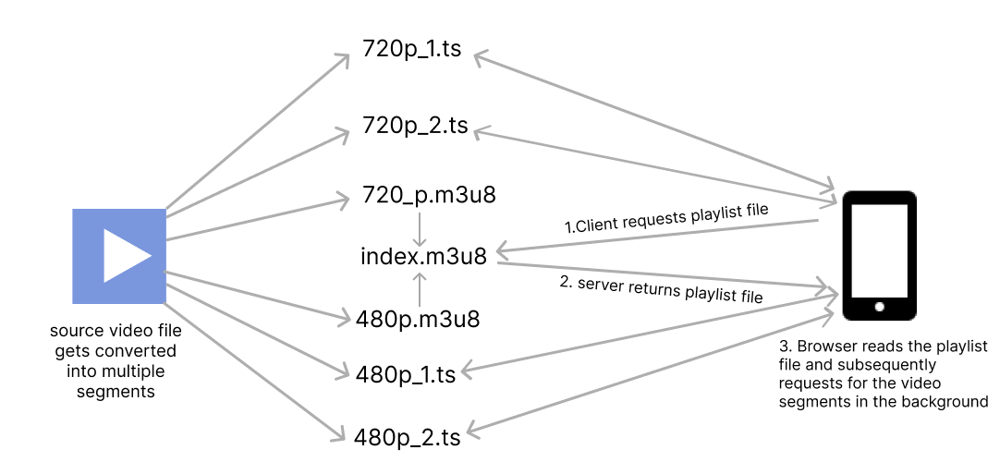

<center>
  <i>
    Photo by{" "}
    <a
      href="https://www.pexels.com/@ivan-cujic-20495/"
      target="_blank"
      rel="noreferrer"
    >
      Ivan Cujic
    </a>{" "}
    on{" "}
    <a
      href="https://www.pexels.com/photo/cloud-in-sky-and-building-109479/"
      target="_blank"
      rel="noreferrer"
    >
      Pexels
    </a>
  </i>
</center>

# Introduction

Streaming video through the web has always been an interesting problem.   Cisco [predicted](https://www.cisco.com/c/dam/m/en_us/solutions/service-provider/vni-forecast-highlights/pdf/Global_2021_Forecast_Highlights.pdf) that video traffic will contribute to 80% of all internet traffic in 2021. Nearly 1 billion hours of video is streamed on youtube every day and  Platforms like Netflix and Amazon Prime Video heavily rely on video streaming to deliver their entertainment platform. While traditional streaming methods used a single video file and html5 video player, today's techniques are much more complex and efficient. Adaptive Bitrate streaming is the most commonly used technique today to stream video over the web. 


## Adaptive Bitrate Streaming (ABR)

ABR is a technique used for streaming videos over HTTP where the source content is encoded at multiple bit rates and the client can automatically or manually switch to different qualities based on available network bandwidth. Streaming giants like Youtube and Netflix use ABR to adapt to their client's network bandwidth and automatically switch to the right video quality. When a video is uploaded to youtube multiple copies of the same video are made, each with different bitrates and the client can manually or automatically switch between different bitrates. Bitrates refer to the number of bits a video outputs per second. The more the bitrate, the more detailed the video will be. There are several streaming protocols that implements Adaptive Bitrate Streaming. Some of them are:-

- HTTP Live Streaming (HLS)
- Dynamic Adaptive Streaming over HTTP (DASH)
- Microsoft Smooth Streaming (MSS)
- Adobe HTTP Dynamic Streaming (HDS)

Most ABR protocols work by dividing the video file into multiple segments of different bitrates and using a manifest file to tell the client where to find each segment. The reason the source video is divided into multiple segments of different bitrates instead of a single file of different bitrate is that it will be much easier to handle the video on the frontend. In this tutorial, we will be using HTTP Live Streaming (HLS) protocol to make videos suitable for ABR streaming. Before jumping to the tutorial let's get to know more about HLS. If you want to directly jump to the tutorial, click [here](#tutorial).

## HTTP Live Streaming (HLS)

HTTP Live Streaming (HLS) is an HTTP-based media streaming protocol developed by Apple. It was initially developed for video streaming on iPhone and is currently supported by many browsers. The way HLS works is by converting the source video into a configurable number of segment files with an extension of '.ts' and using an m3u8 file as a manifest file. This file is also called a playlist file. HLS has support for live streaming and ad injection.


### Playlist files and segments
An m3u8 file is an extended version of an m3u file which is a plain text file format originally created to organize mp3 playlists. It is saved with the m3u8 extension and is composed of a set of tags. A hls segment contains a part of the source video and has an extension of ts. The playlist file contains metadata and URL's to the different segments. The recommended duration for a segment is between 4 to 5 seconds.

```
// 720p.m3u8
 #EXTM3U                 // all hls playlist files must start with this tag
 #EXT-X-VERSION:3        // version
 #EXT-X-TARGETDURATION:5 // maximum duration of a segment
 #EXT-X-MEDIA-SEQUENCE:0 // indicates the sequence of the first url, usually 0
 #EXT-X-PLAYLIST-TYPE:VOD // stands for video on demand, used to differentiate from a live stream
 #EXTINF:4.804800,       // duration of the segment file below
 720p_0.ts               // this is the segment url, since we are putting every file in a single folder this is relative to the folder where the playlist file resides. It can also be absolute like https://yourcdn.com/videofolder/720p_0.ts
 #EXTINF:3.203200,
720p_1.ts
#EXTINF:4.804800,
720p_2.ts
#EXTINF:3.203200,
720p_3.ts
#EXTINF:4.804800,
720p_4.ts
#EXTINF:3.203200,
720p_5.ts
#EXTINF:4.337667,
720p_6.ts
#EXT-X-ENDLIST // indicates that no more media files will be added to the playlist file
```

<center>
    Example playlist file for segments with suitable bitrate for 720p
</center>

> Dynamic Adaptive Streaming over HTTP (DASH) uses a similar configuration with .m4s extension for the segments and XML for the manifest file

For adaptive bitrate streaming, The source video file needs to be converted to segments of all the bitrates for different resolutions like 360p, 480p, 720p and 1080p and for each bitrate, we will create a separate playlist file linking its corresponding segments and finally link all the playlist file using a single index.m3u8 file which will be read by the browser. We will be putting all the playlist files and segments for a particular video under a single folder. This is only one of the many ways by which you can organize the playlist files and segments. However you organize your segments and playlists, the URL field of every segment defined in the playlist file should be reachable by the client.

In the case of a live stream, the segments should be dynamically created and the playlist file should be updated accordingly.



<center>
    Working of HLS
</center>


```
// index.m3u8
 #EXTM3U
 #EXT-X-VERSION:3
 #EXT-X-STREAM-INF:BANDWIDTH=800000,RESOLUTION=640x360 // maximum bandwidth and resolution required in bits per second for the client to play the playlist below. 
 360p.m3u8     // playlist file containing reference to segments for above bandwidth and resolution, can also be absolute like https://yourcdn.com/videofolder/360p.m3u8
 #EXT-X-STREAM-INF:BANDWIDTH=1400000,RESOLUTION=842x480
 480p.m3u8
 #EXT-X-STREAM-INF:BANDWIDTH=2800000,RESOLUTION=1280x720
 720p.m3u8
#EXT-X-STREAM-INF:BANDWIDTH=5000000,RESOLUTION=1920x1080
1080p.m3u8
```

<center>
    index.m3u8 which links to all other m3u8 files for different resolutions
</center>


We can use [ffmpeg](https://ffmpeg.org/) to encode and generate the segments and playlist files. FFmpeg supports HLS encoding out of the box and will automatically set the tags and create the playlist files for us. For a full list of supported tags, refer to [Apple's documentation](https://developer.apple.com/documentation/http_live_streaming/example_playlists_for_http_live_streaming/video_on_demand_playlist_construction) 

## HLS on the browser

As of the time of writing, HLS is natively supported only on a [few](https://caniuse.com/?search=hls) browsers. Mainstream browsers like chrome and firefox are yet to add native support for HLS playback. But this doesn't mean that we can't play HLS on those browsers, HLS can be used with a javascript library in browsers that doesn't support it natively as long as they support [Media Source Extensions](https://developer.mozilla.org/en-US/docs/Web/API/Media_Source_Extensions_API)(MSE). Media Source Extensions is a standard javascript API that allows customization of the input to media elements such as the html5 `<video>` tag using `MediaSource` object. The MediaSource object contains references to multiple `SourceBuffer` objects that represent the different chunks of media that make up the entire stream. Hence, the client can progressively fetch the different segments using the native `fetch` API and fill the different SourceBuffers for different bitrates and finally, this SourceBuffer is fed into the video element using MediaSourceExtension Object for playback. The quality is changed by switching between different SourceBuffers. All this seems like a lot of work and thankfully there are lots of battle-tested libraries out there that will do all of the work for us. Popular libraries include [videojs](https://videojs.com/), Google's [shakaplayer](https://github.com/shaka-project/shaka-player) and [hls.js](https://github.com/video-dev/hls.js/).

<h1 id="tutorial">Video processing pipeline using AWS</h1>

Now that we have an idea about what HLS is, Let's implement a video processing pipeline using AWS that takes in a source video, makes it suitable for HLS streaming and streams it to users using above mentioned videojs library.

AWS service we will be using:-

1. S3 - to store source video and output video
2. Lambda - to convert the video into different formats using FFmpeg
3. Step Functions - to coordinate between lambda functions
4. DynamoDB - to store video metadata
5. Cloudfront - to distribute video to users

We will be also using [serverless framework](https://www.serverless.com/) for deploying the infrastructure, [FFmpeg](https://ffmpeg.org/) to convert video into HLS, [Nodejs](https://nodejs.org/en/) to write lambda functions and [videojs](https://videojs.com/) on the client side.

## What we will be making


